# Dashboard DIP · Seconser Niterói

Dashboard operacional do **Departamento de Iluminação Pública (DIP)** da Seconser Niterói. Acompanha o fluxo de entrada e saída de demandas, qualidade do atendimento e distribuição geográfica dos serviços no município.

🔗 **[Acessar o dashboard](https://alves077.github.io/dashboard-seconser/)**

---

## Páginas

### Visão Geral
Painel principal com KPIs consolidados (total de serviços, concluídos, em aberto, em atraso, reaberturas e tempo médio) e indicadores de situação em tempo real na topbar. Distribuição por categoria, reaberturas por categoria e região, tempo de execução por faixa, serviços por região com volume/percentual/tempo médio/atraso, top 10 bairros e volume mensal de demandas com curvas de entradas e concluídos. Filtros por período, região e categoria.

Responsivo: KPIs em 2 colunas, grids em coluna única, barras horizontais adaptadas para mobile.

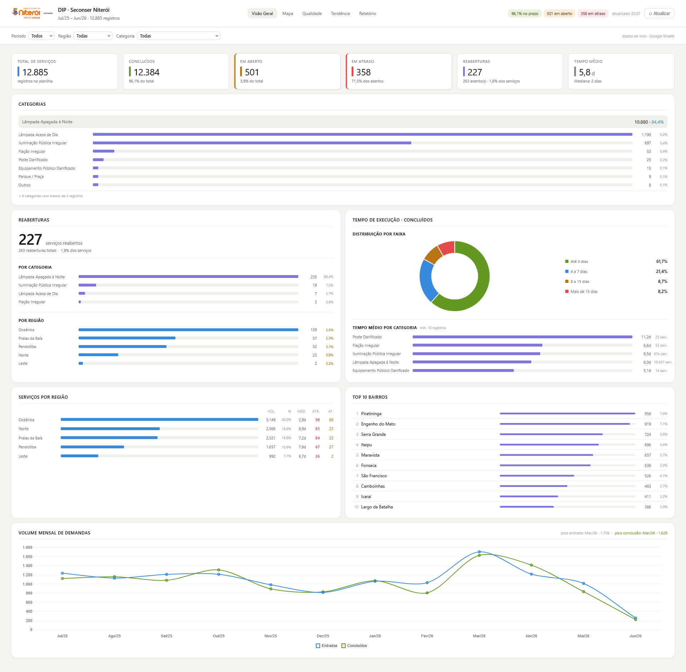
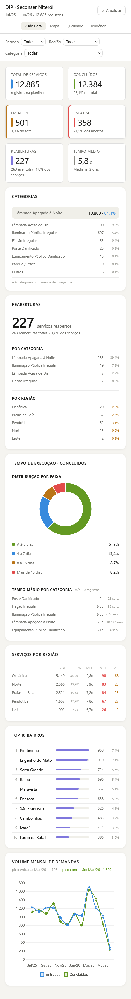

### Mapa
Visualização georreferenciada de todos os registros sobre o mapa de Niterói (OpenStreetMap via Leaflet). Filtros por situação (OK / No Prazo / Em Atraso) e por região, com zoom automático ao filtrar. Coordenadas validadas por bounding box do município — pontos fora de Niterói são descartados silenciosamente.

Painel lateral com KPIs de situação atual, abertos por região, top bairros em aberto, serviços mais antigos em atraso e distribuição por categoria. Em mobile, o mapa é ocultado e apenas o painel lateral é exibido.

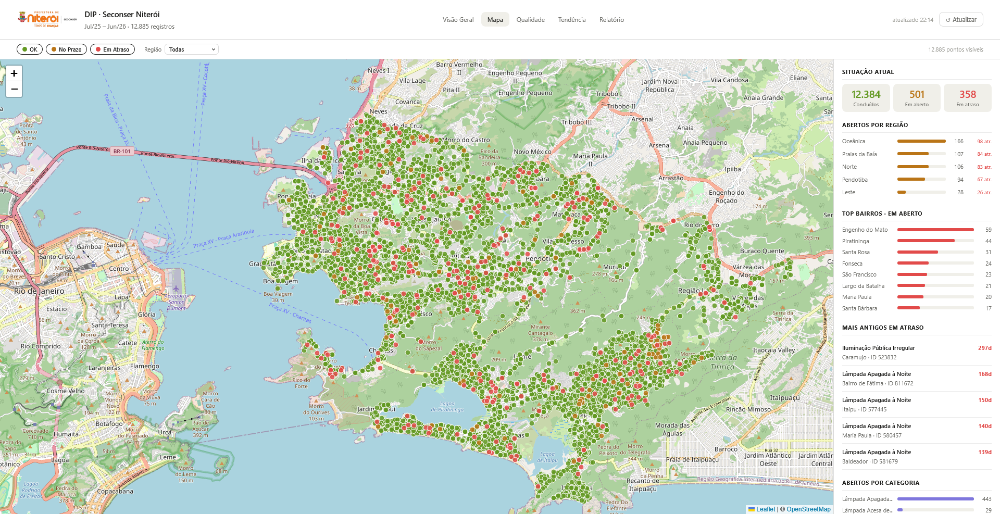
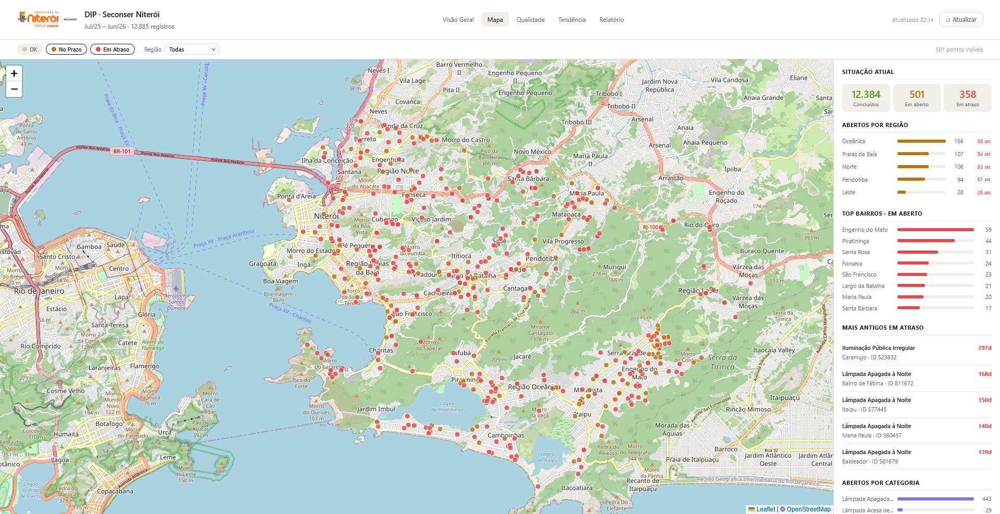
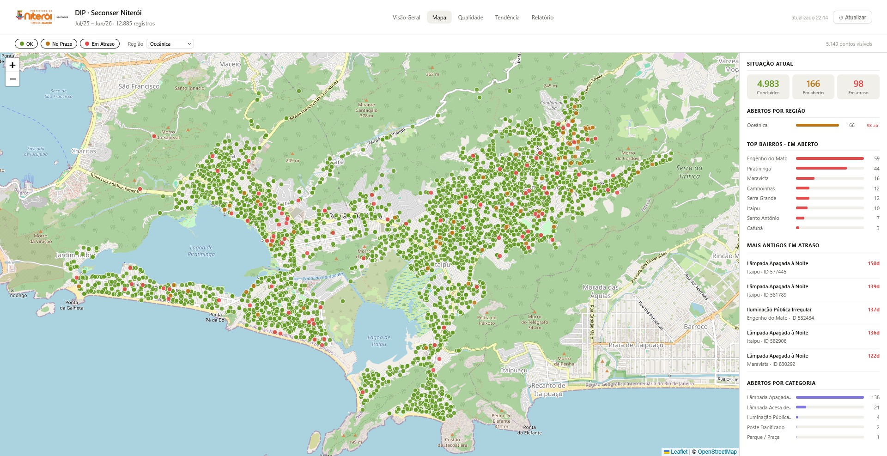
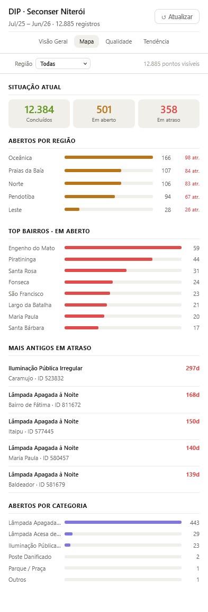

### Qualidade
Indicadores de qualidade: taxa de conclusão, reincidência, resolução rápida (≤3 dias), cauda longa (>15 dias), tempo médio e percentual em atraso agora. Atraso por região (piores primeiro), reincidência por categoria, histograma de frequência por dia de execução, distribuição de faixas por região (tabela com totais) e evolução mensal de tempo médio e cauda longa (eixos duplos).

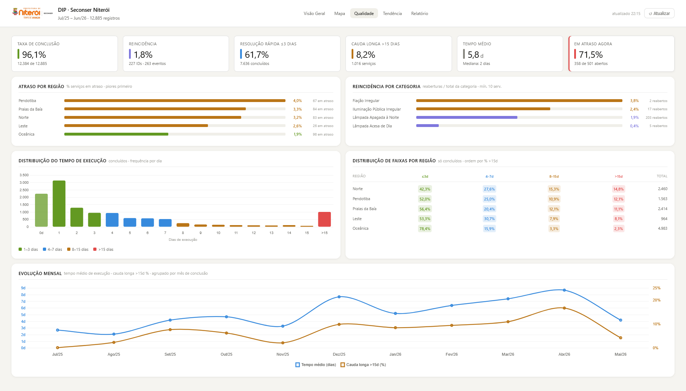
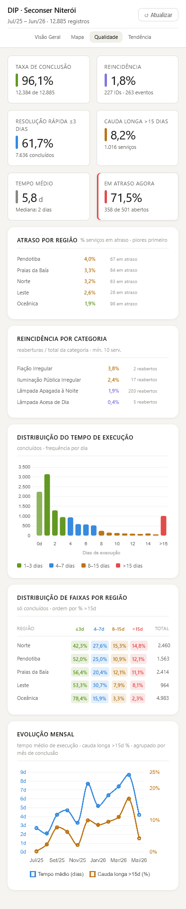

### Tendência
Análise temporal: mês de pico, último mês completo, variação mensal, média mensal, saldo acumulado e cumprimento de prazo global. Gráfico de fluxo (entradas × concluídos × saldo acumulado em eixo direito), tabela de calor de sazonalidade por categoria (top 6) e evolução mensal de percentual fora do prazo e tempo médio de execução.

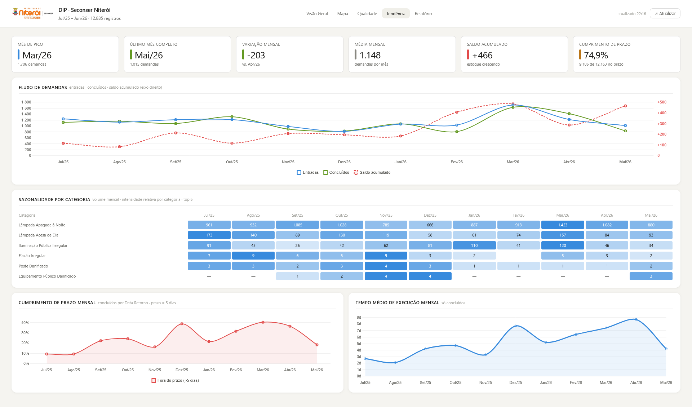
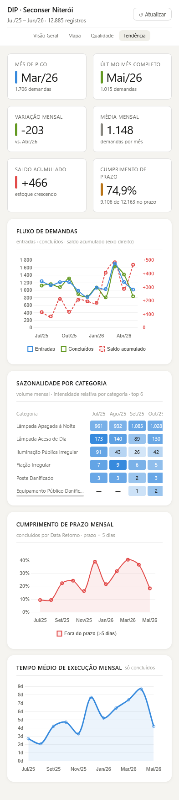

### Relatório Mensal
Página standalone (`relatorio.html`) acessível via nav do dashboard (link oculto em mobile). Gera um relatório mensal imprimível com seleção de mês de referência.

Conteúdo: contexto de saldo do mês anterior, KPIs do mês (entradas, concluídos, no prazo, tempo médio, em aberto, reaberturas), distribuição por categoria e top bairros (com concluídos e em atraso), distribuição por faixa de execução (donut + legenda com absoluto e %) e distribuição por região. Campo de observações que some na impressão se vazio. Otimizado para impressão em PDF.

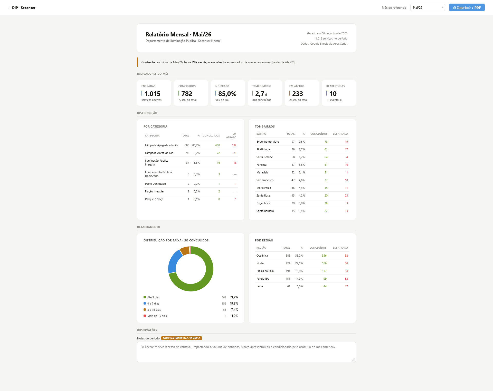

---

## Stack

| Camada | Tecnologia |
|---|---|
| Frontend | HTML5 + CSS3 + JavaScript puro (sem framework) |
| Gráficos | Chart.js 4.4.1 |
| Mapa | Leaflet.js 1.9.4 |
| Parse de dados | PapaParse 5.4.1 |
| Fonte de dados | Google Sheets privado via Google Apps Script (proxy com token) |
| Cache L1 | CacheService do Apps Script (TTL 5 min, chunks de 90 KB) |
| Cache L2 | localStorage no browser (TTL 30 min, chave `dip_csv_v2`) |
| Hospedagem | GitHub Pages |

---

## Fonte de Dados

Os dados são exportados de uma planilha Excel alimentada manualmente pela equipe do DIP, processada via Power Query e publicada no Google Sheets. O dashboard acessa os dados via **Google Apps Script** com autenticação por token, mantendo a planilha privada.

O cache opera em duas camadas: o Apps Script armazena o CSV fragmentado em memória por 5 minutos (evitando leituras repetidas da planilha), e o browser armazena localmente por 30 minutos (evitando requisições ao servidor). O botão **Atualizar** limpa o cache local e força uma nova busca — útil após importar dados novos.

A coluna `Situação` do CSV é **ignorada** — o dashboard recalcula dinamicamente a situação de cada serviço com base na data atual e no prazo, garantindo leituras corretas em fins de semana e feriados em que a planilha não é atualizada.

---

## Modelo de Dados

| Coluna | Tipo | Descrição |
|---|---|---|
| ID Colab | Inteiro | Identificador do serviço (pode repetir em reaberturas) |
| Categoria | Texto | Tipo de ocorrência |
| Bairro | Texto | Bairro do serviço |
| Região | Texto | Região de Niterói |
| Data Saída | Data dd/mm/aaaa | Data de abertura/envio |
| Data Retorno | Data dd/mm/aaaa | Data de conclusão (vazio se em aberto) |
| Prazo | Data dd/mm/aaaa | Data Saída + 5 dias úteis |
| Situação | Texto | OK / Em Atendimento / Em Atraso — **ignorado, recalculado no cliente** |
| Dias Execução | Inteiro | Dias entre saída e retorno |
| Faixa Execução | Texto | 0. Em Atendimento / 1. Até 3 dias / 2. 4 a 7 dias / 3. 8 a 15 dias / 4. Mais de 15 dias |
| Ocorrências | Inteiro | Quantas vezes o ID aparece na tabela |
| Latitude | Decimal (vírgula) | Coordenada geográfica |
| Longitude | Decimal (vírgula) | Coordenada geográfica |

---

## Estrutura de Arquivos

```
dashboard-seconser/
├── index.html                  — Visão Geral (página principal)
├── relatorio.html              — Relatório mensal standalone
├── css/
│   ├── main.css                — Entry point via @import
│   ├── base.css                — Reset, variáveis CSS, body, loading, botões
│   ├── layout.css              — Topbar, nav, filtros, page, grids
│   ├── components.css          — KPIs, cards, barras, badges, rankings
│   ├── responsive.css          — Breakpoints 1100px e 720px
│   └── mapa.css                — Estilos exclusivos da página de mapa
├── js/
│   ├── config.js               — URL do Apps Script, CACHE_TTL_MS, estado global, paleta
│   ├── utils.js                — Funções utilitárias (formatação, datas, agrupamentos)
│   ├── data.js                 — Fetch + cache L2 + normalização + recálculo de Situação
│   ├── charts.js               — Fábricas de gráficos Chart.js (donut, barras, linhas)
│   ├── filters.js              — Filtros e topbar da Visão Geral
│   ├── render.js               — Render da Visão Geral
│   └── main.js                 — Ponto de entrada
├── pages/
│   ├── mapa.html               — Mapa (JS inline)
│   ├── qualidade.html
│   ├── qualidade.js
│   ├── tendencia.html
│   └── tendencia.js
├── img/
│   └── logo-seconser.png
└── docs/
    └── screenshots/
        ├── visao-geral.png
        ├── visao-geral-mobile.png
        ├── mapa-completo.png
        ├── mapa-abertos.png
        ├── mapa-regiao.png
        ├── mapa-mobile.png
        ├── qualidade.png
        ├── qualidade-mobile.png
        ├── tendencia.png
        ├── tendencia-mobile.png
        └── relatorio.png
```

---

## Atualização dos Dados

Para atualizar os dados do dashboard, basta atualizar a planilha Excel de origem e exportar para o Google Sheets via Power Query. O dashboard buscará os dados atualizados automaticamente após expiração do cache de 30 minutos, ou imediatamente ao clicar em **Atualizar**.

Para trocar a planilha de origem, atualize o ID no Google Apps Script e a URL em `js/config.js`.
